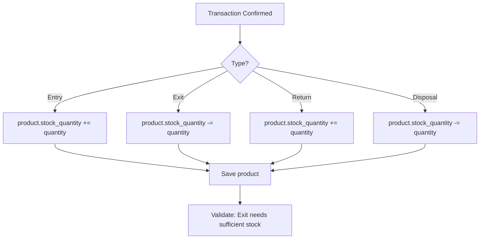

# Plan: Add Stock Quantity Fields and Transaction Integration

## Objective
Add `stock_quantity` and `initial_quantity` fields to the Product model and implement automatic quantity updates during transaction operations.

## New Product Fields
```python
stock_quantity = models.PositiveIntegerField('الكمية المتوفرة', default=0)
initial_quantity = models.PositiveIntegerField('الكمية الأولية', default=0)
```

## Business Logic: Product Quantity Updates

### Voucher Type Effects on Stock
| Voucher Type | Action | Stock Change |
|-------------|--------|--------------|
| EntryVoucher | Confirmed | +quantity |
| ExitVoucher | Confirmed | -quantity |
| ReturnVoucher | Confirmed | +quantity |
| DisposalVoucher | Confirmed | -quantity |

### Helper Functions to Create
Create in [`transactions/utils.py`](transactions/utils.py) or add to [`transactions/views.py`](transactions/views.py):

```python
def update_product_stock(product, quantity_change):
    """Update product stock_quantity by the given amount"""
    product.stock_quantity = models.F('stock_quantity') + quantity_change
    product.save(update_fields=['stock_quantity'])
    product.refresh_from_db()
```

### Views to Modify

#### Entry Voucher
- [`entry_voucher_confirm()`](transactions/views.py:166): Add +quantity to product.stock_quantity
- Need to handle draft → confirmed transition only

#### Exit Voucher  
- [`exit_voucher_confirm()`](transactions/views.py): Add -quantity to product.stock_quantity
- Need to check sufficient stock before confirming

#### Return Voucher
- [`return_voucher_confirm()`](transactions/views.py): Add +quantity to product.stock_quantity

#### Disposal Voucher
- [`disposal_voucher_confirm()`](transactions/views.py): Add -quantity to product.stock_quantity

### Editing/Deleting Vouchers
When editing or deleting confirmed vouchers:
1. Reverse the original quantity change
2. Apply new quantity change (if editing)
3. Reset status to 'draft' before allowing changes

## Files to Modify

| File | Changes |
|------|---------|
| [`inventory/models.py`](inventory/models.py) | Add `stock_quantity` and `initial_quantity` fields to Product |
| [`inventory/forms.py`](inventory/forms.py) | Add fields to ProductForm |
| [`transactions/views.py`](transactions/views.py) | Add quantity update logic to voucher views |
| [`templates/inventory/product_list.html`](templates/inventory/product_list.html) | Display stock_quantity column |
| [`templates/inventory/product_detail.html`](templates/inventory/product_detail.html) | Display both quantity fields |
| [`AGENTS.md`](AGENTS.md) | Update documentation |

## Implementation Steps

1. Add fields to Product model
2. Create and apply migrations
3. Add helper function for stock updates
4. Update entry_voucher_confirm()
5. Update exit_voucher_confirm()
6. Update return_voucher_confirm()
7. Update disposal_voucher_confirm()
8. Add edit/delete handling for confirmed vouchers
9. Update templates
10. Update AGENTS.md

## Workflow Diagram


